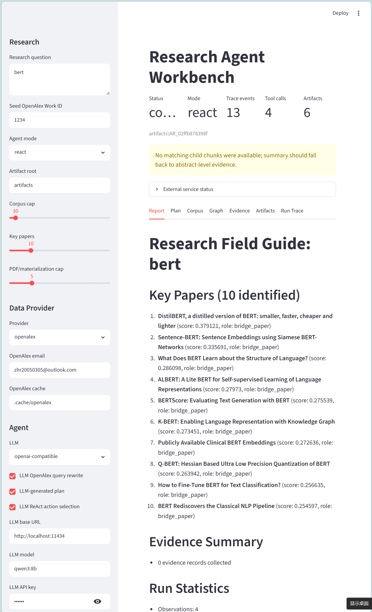
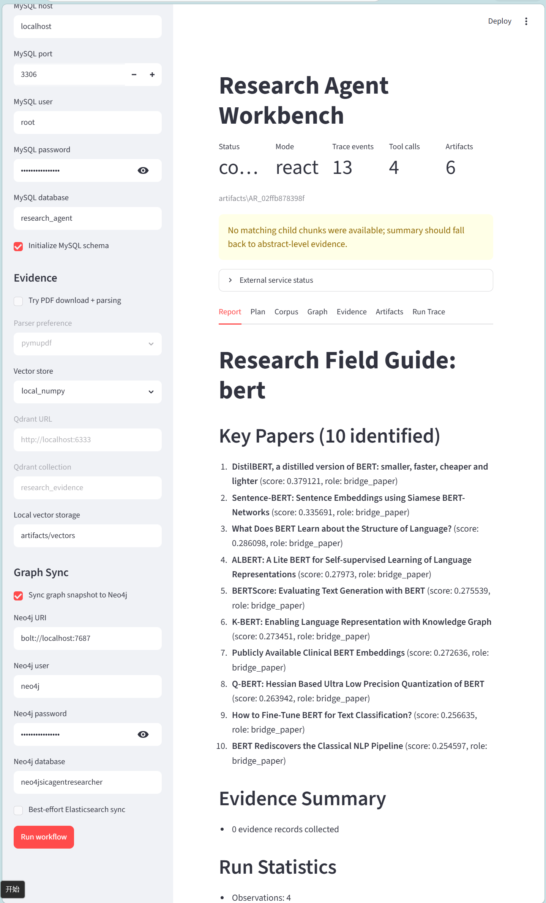

# Research Agent / OpenAlex 自动调研系统

本项目是一个面向科研领域调研的 Agent MVP：输入研究问题、陌生领域或种子论文后，系统尝试构建 OpenAlex 文献集合，清洗为可追溯的实体关系数据，生成引用与主题结构，识别关键论文，并结合 Evidence RAG 输出领域指南和运行 Artifact。

当前实现更适合描述为：规则驱动的调研工作流 + 可选 LLM 辅助 + OpenAlex/图分析/证据检索模块骨架。默认可离线运行；真实 OpenAlex、MySQL、Neo4j、Qdrant、LLM endpoint 都是可配置增强。

## 项目目标

- 输入研究问题、陌生研究领域或 OpenAlex seed work。
- 获取 OpenAlex 文献数据，并清洗成规范化实体关系库。
- 构建 citation、topic、author、institution 等图结构。
- 使用 PageRank、community、bridge score 等图算法识别关键论文。
- 对关键论文做摘要或 PDF 级 Evidence RAG。
- 生成可追溯的 field guide、trace、corpus、graph、evidence artifacts。

## 当前能力状态

- 支持 `fixture` 离线 demo，适合 smoke test 和 UI 联调。
- 支持真实 OpenAlex 数据获取入口，建议配置 OpenAlex email 和缓存目录。
- 支持 MySQL 规范化实体关系存储，实体保留内部自增主键和 OpenAlex ID。
- 支持可选 Neo4j 同步，用于浏览 Paper/Author/Institution/Venue/Concept 图。
- 支持 Streamlit 工作台，用于配置 provider、Agent mode、LLM、存储和图同步。
- 当前报告是 `field_guide.md` 初版；完整综述级 report writer、细粒度选文理由和阅读计划仍需增强。

## 快速开始

建议先创建并激活自己的 Python 环境，然后安装项目和常用可选依赖：

```powershell
pip install -e .
pip install streamlit pyalex pymysql neo4j qdrant-client openai
```

使用前请先配置 `.env` （在文件根目录创建 `.env` 文件，并在文件中填写相应配置），至少需要 `RA_LLM_API_KEY`，如果使用 OpenAI-compatible LLM endpoint，还需要配置 `RA_LLM_BASE_URL` 和 `RA_LLM_MODEL`。

```text
RA_LLM_API_KEY=<your_api_key_here>                        # 替换为你的 API key
RA_LLM_BASE_URL=https://open.bigmodel.cn/api/paas/v4      # 替换为你的 LLM endpoint URL
RA_LLM_MODEL=glm-4.7-flash                                # 替换为你的 LLM 模型名称
RA_LLM_TIMEOUT=30                                         # 可选，LLM 请求超时时间（秒）
RA_LLM_DEBUG=1                                            # 可选，开启 LLM 调试日志
RA_LLM_STREAM=1                                           # 可选，开启 LLM 流式输出
```

启动 Streamlit UI：

```powershell
streamlit run src\research_agent\ui\app.py
```

第一次运行建议在 UI 中选择 `fixture + local artifacts`，确认工作流能生成 `field_guide.md`、`trace.json`、`run.json` 等 Artifact。需要真实数据时，再在侧边栏开启 OpenAlex、MySQL、Neo4j、Qdrant 或 LLM 配置。

在 Research question 输入框输入问题，进行配置后，最终选择 `Run Workflow`，等待运行完成后 `research-agent-workbench` 查看生成的领域指南和调研过程追踪。

其界面如下所示：


OpenAlex ELT CLI 的离线 smoke test：

```powershell
python scripts\openalex_elt_cli.py bert --provider fixture
```

真实 OpenAlex + MySQL + Neo4j 的完整 CLI 参数、Neo4j Browser 查询示例和常见问题见 [scripts/openalex_elt_cli.md](scripts/openalex_elt_cli.md)。

## OpenAlex ELT CLI

`scripts/openalex_elt_cli.py` 是一键式 OpenAlex ELT 入口，主流程是：

```text
OpenAlex 搜索 -> seed 选择 -> BFS 扩展 -> 清洗 -> MySQL 入库 -> 可选 Neo4j 同步
```

联机运行时请使用占位符替换成本地配置，不要把真实密码提交到仓库：

```powershell
python scripts\openalex_elt_cli.py transformer `
  --provider openalex `
  --openalex-email you@example.com `
  --init-schema `
  --mysql-host localhost `
  --mysql-user root `
  --mysql-password <password> `
  --mysql-database research_agent `
  --sync-neo4j `
  --neo4j-user neo4j `
  --neo4j-password <password> `
  --neo4j-database neo4j `
  --max-depth 1 `
  --max-citing-fanout 100
```

详细参数说明请阅读 [scripts/openalex_elt_cli.md](scripts/openalex_elt_cli.md)。

## 项目结构

- `src/research_agent/core`：公共模型、配置、Artifact store、工具函数。
- `src/research_agent/runtime`：Agent runtime、ReAct、Planner-Executor、runner、trace、budget。
- `src/research_agent/skills`：七个调研 skill，负责把调研任务串成工作流。
- `src/research_agent/services`：Scholarly Data、Graph Analytics、Evidence RAG 的进程内服务实现。
- `src/research_agent/mcp_servers`：stdio MCP server 包装、tool schema、service bridge。
- `src/research_agent/data`：OpenAlex source、cleaner、PDF/parser、embedding、vector store。
- `src/research_agent/persistence`：MySQL repository/inserter、Neo4j sync、ES sync。
- `src/research_agent/ui`：Streamlit 工作台。
- `scripts`：命令行入口和实验脚本。
- `tests`：单元测试和集成测试。

## MCP 约定

核心 MCP provider 分为三类：

- `scholarly-data`：OpenAlex corpus、seed lineage、work 查询。
- `graph-analytics`：graph snapshot、PageRank、community、key paper ranking。
- `evidence-rag`：PDF/摘要 materialization、parent-child chunks、evidence bundle。

MCP tool 返回统一 `MCPResult`，核心字段包括：

- `tool_call_id`
- `analysis_run_id`
- `task_id`
- `provider`
- `status`
- `summary`
- `preview`
- `artifact_id`
- `warnings`
- `provenance`

大结果写入 `artifacts/{run_id}/...`，`MCPResult` 只保留摘要、预览和 Artifact 引用，避免在 trace 中塞入过大的数据对象。

## Skills 约定

当前注册的七个 skill：

- `scope_new_field`
- `discover_research_perspectives`
- `build_research_corpus`
- `map_field_structure`
- `identify_key_papers`
- `analyze_key_papers`
- `generate_field_guide`

Skill 接口统一为：

```python
def skill_name(state, mcp, task):
    ...
```

约定：

- Skill 通过共享 `state` 传递 `corpus`、`field_structure`、`key_papers`、`evidence_bundle`、`field_guide`。
- Skill 通过 `mcp.call(...)` 访问文献数据、图分析和证据检索能力。
- Skill 应优先写入可追溯 Artifact，而不是只返回内存对象。
- 新增 skill 时应在 `src/research_agent/skills/__init__.py` 注册，并保证失败时能给出清晰 warning 或 error。

## 数据与存储

MySQL 使用 OpenAlex 规范化实体关系库：

- `works`、`authors`、`institutions`、`venues`、`concepts` 等实体表保留内部自增主键和 `openalex_id` 唯一键。
- 作者-机构关系拆为四张表：
  - `work_authors`
  - `author_institutions`
  - `work_institutions`
  - `work_author_affiliations`
- `corpus_membership` 记录某次调研 corpus 与 work 的关系。
- `citations` 记录引用关系，并保留 OpenAlex source ID。

Neo4j 同步使用 Paper、Author、Institution、Venue、Concept 等节点，以及 `CITES`、`AUTHORED`、`AFFILIATED_WITH`、`ASSOCIATED_WITH`、`AFFILIATED_IN_WORK` 等关系。

## LLM 与 Agent 模式

默认模式不强制依赖 LLM，适合离线运行和稳定测试。

可选接入 DeepSeek 或 OpenAI-compatible endpoint：

- LLM query planning：把用户问题改写成更适合 OpenAlex 的检索词。
- LLM ReAct：在受控候选动作中选择下一步 tool call。
- LLM Planner：生成基于已注册 skills 的任务计划。

当前状态转移仍受 runtime 节点、候选工具和 skill registry 约束；不要将当前实现描述为完全开放式自主 Agent。

## 输出结果

一次运行通常会在 `artifacts/{run_id}/` 下生成：

- `reports/field_guide.md`
- `reports/trace.json`
- `reports/run.json`
- `reports/plan.json`
- `corpora/*.json`
- `graph/*.json`
- `evidence/*.json` 或 `*.jsonl`

UI 和 CLI 都应优先展示这些 Artifact，而不是只依赖控制台输出。

## 测试

推荐测试命令：

```powershell
$env:PYTHONDONTWRITEBYTECODE='1'
python -m pytest -q
```

如只想验证 OpenAlex 实体关系库、图分析、runner 和 Neo4j 同步相关路径，可以先运行相关测试文件：

```powershell
$env:PYTHONDONTWRITEBYTECODE='1'
python -m pytest -q tests\test_openalex_entity_store.py tests\test_scholarly_graph_rag.py tests\test_runtime_runner.py tests\test_neo4j_sync_safe_props.py
```

## 安全与配置

- 不提交 `.env`、真实数据库密码、API key 或个人邮箱。
- `.env.example` 仅作为配置模板。
- README 和文档中的命令示例使用 `you@example.com`、`<password>`、`<api-key>` 等占位符。
- OpenAlex 联机模式建议配置 email 和 cache dir，以减少重复请求并进入 polite pool。

## 当前限制

- 完整综述级 report writer 仍需增强；当前 `field_guide.md` 是初版领域指南。
- PaperQA2 和 GPT Researcher 属于可选增强，不是 MVP 必需路径。
- Qdrant、Neo4j、MySQL、OpenAlex 真实服务依赖本地安装和配置。
- 外部服务不可用时，系统应降级到 fixture 或 local artifacts，而不是静默伪装为真实完整调研。
- LLM 当前主要用于查询规划、候选动作选择和计划生成；最终报告的深度综合能力仍需继续接线。
