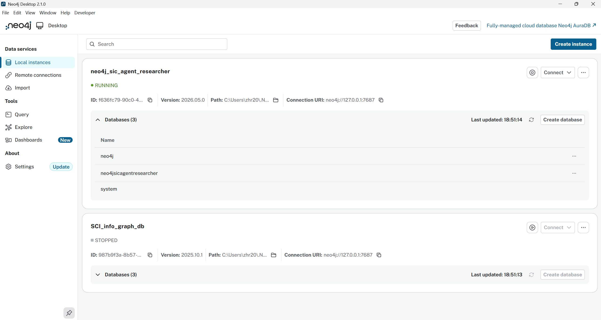
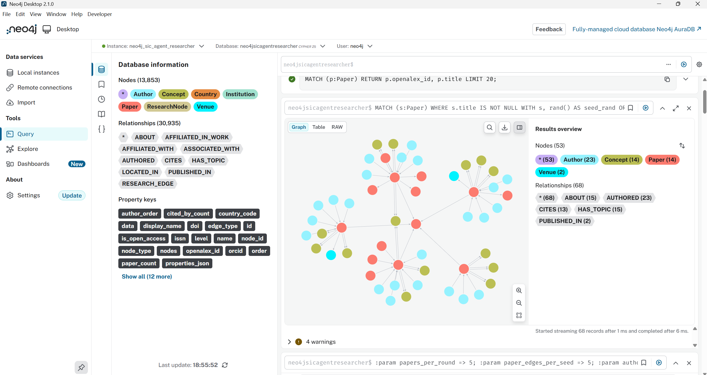

# `scripts/openalex_elt_cli.py` 使用说明

`scripts/openalex_elt_cli.py` 是一个一键式 OpenAlex ELT 入口，执行流程如下：

`OpenAlex 搜索 -> 自动选 seed -> BFS 2 层扩展 -> 引文抓取 -> 清洗 -> MySQL 入库 -> 可选 Neo4j 同步`

它适合做两类事情：

1. 联机跑真实 OpenAlex 数据
2. 用 `fixture` 模式做离线联调和 smoke test

## 快速开始

首先验证 python 环境和依赖，是否完整：

```bash
pip install pyalex neo4j tqdm pymysql
```

保证 MySQL 和 Neo4j 服务可用。Neo4j 安装可以参考：[Neo4j安装与配置以及JDK安装与配置教程（超详细）](https://blog.csdn.net/2301_77554343/article/details/135692019)

neo4j 正常启动后，其界面通常在 `http://localhost:7474`，默认用户名 `neo4j`，密码是你安装时设置的。大致如下图所示：


然后就可以运行脚本了，以下是一个示例命令：

```bash
python scripts/openalex_elt_cli.py bert `
  --provider openalex `
  --openalex-email zhr20050305@outlook.com `
  --init-schema `
  --mysql-host localhost `
  --mysql-user root `
  --mysql-password ZHRhenry20050305 `
  --mysql-database research_agent `
  --sync-neo4j `
  --neo4j-user neo4j `
  --neo4j-password ZHRhenry20050305 `
  --neo4j-database neo4jsicagentresearcher `
  --max-depth 1 `
  --max-citing-fanout 100
```

执行完成后可在 Neo4j Browser 里查看结果：

```cypher
:param papers_per_round => 5;
:param paper_edges_per_seed => 5;
:param author_edges_per_seed => 5;
:param concept_edges_per_seed => 8;
:param venue_edges_per_seed => 3;
```

```cypher
MATCH (s:Paper)
WHERE s.title IS NOT NULL
WITH s, rand() AS seed_rand
ORDER BY seed_rand
LIMIT $papers_per_round

CALL {
  WITH s
  MATCH p = (s)-[r]-(n:Paper)
  WITH p, rand() AS edge_rand
  ORDER BY edge_rand
  LIMIT $paper_edges_per_seed
  RETURN collect(p) AS paper_paths
}

CALL {
  WITH s
  MATCH p = (s)-[r]-(n:Author)
  WITH p, rand() AS edge_rand
  ORDER BY edge_rand
  LIMIT $author_edges_per_seed
  RETURN collect(p) AS author_paths
}

CALL {
  WITH s
  MATCH p = (s)-[r]-(n:Concept)
  WITH p, rand() AS edge_rand
  ORDER BY edge_rand
  LIMIT $concept_edges_per_seed
  RETURN collect(p) AS concept_paths
}

CALL {
  WITH s
  MATCH p = (s)-[r]-(n:Venue)
  WITH p, rand() AS edge_rand
  ORDER BY edge_rand
  LIMIT $venue_edges_per_seed
  RETURN collect(p) AS venue_paths
}

WITH paper_paths + author_paths + concept_paths + venue_paths AS paths
UNWIND paths AS p
RETURN p;
```

可以得到类似下面的结果：



## 1. 运行前准备

### Python 依赖

建议确保以下依赖可用：

- `pyalex`：联机访问 OpenAlex
- `neo4j`：同步到 Neo4j
- `tqdm`：进度条
- `pymysql`：MySQL 建表和写入

如果你使用项目的可选依赖安装方式，可以按需补齐：

```bash
pip install pyalex neo4j tqdm pymysql
```

### 外部服务

脚本默认会连接以下服务：

- OpenAlex API
- MySQL
- Neo4j

如果你只想做离线验证，可以使用：

```bash
python scripts/openalex_elt_cli.py bert --provider fixture
```

这样不会访问 OpenAlex，也不需要 MySQL / Neo4j 真的可用。

## 2. 参数概览

### 必选/常用参数

- `query`
  - 默认值：`bert`
  - OpenAlex 搜索关键词
- `--provider openalex|fixture`
  - `openalex`：真实 OpenAlex 数据
  - `fixture`：离线固定样本
- `--max-depth`
  - 默认值：`2`
  - BFS 深度
- `--seed-search-limit`
  - 默认值：`1`
  - 从 OpenAlex 搜索结果里取前几个结果做 seed 候选，默认选 top1

### 引文抓取控制

- `--max-reference-fanout`
  - 默认值：`0`
  - 单个 work 最多抓取多少条 `referenced_works`
  - `0` 表示尽可能全量抓取
- `--max-citing-fanout`
  - 默认值：`0`
  - 单个 work 最多抓取多少条 citing works
  - `0` 表示尽可能全量抓取

### MySQL

- `--init-schema`
  - 先创建 MySQL 表结构
- `--mysql-host` mySQL 主机地址，默认 `localhost`
- `--mysql-port` mySQL 端口，默认 `3306`
- `--mysql-user` mySQL 用户名，默认 `research_agent`
- `--mysql-password` mySQL 密码，默认空
- `--mysql-database` mySQL 数据库名，默认 `research_agent`

### Neo4j

- `--sync-neo4j`
  - 开启 MySQL -> Neo4j 同步
- `--neo4j-uri` Neo4j bolt URI，默认 `bolt://localhost:7687`
- `--neo4j-user` Neo4j 用户名，默认 `neo4j`
- `--neo4j-password` Neo4j 密码，默认空
- `--neo4j-database` Neo4j 数据库名，默认 `neo4j`

### 其他

- `--openalex-email`
  - OpenAlex polite pool 邮箱，建议真实联机时配置
- `--openalex-cache-dir`
  - OpenAlex 响应缓存目录
- `--artifact-root`
  - 运行结果和摘要文件输出目录
- `--log-level`
  - 默认 `INFO`
- `--debug`
  - 打开更详细的调试日志
- `--no-progress`
  - 关闭 `tqdm` 进度条

## 3. 推荐运行方式

### 3.1 联机完整流程

```powershell
python scripts/openalex_elt_cli.py bert `
  --provider openalex `
  --openalex-email zhr20050305@outlook.com `
  --init-schema `
  --mysql-host localhost `
  --mysql-user root `
  --mysql-password ZHRhenry20050305 `
  --mysql-database research_agent `
  --sync-neo4j `
  --neo4j-user neo4j `
  --neo4j-password ZHRhenry20050305 `
  --neo4j-database neo4jsicagentresearcher `
  --max-depth 1 `
  --max-citing-fanout 100
```

### 3.2 离线 smoke test

```powershell
python scripts/openalex_elt_cli.py bert --provider fixture --debug
```

### 3.3 限制抓取规模，先小批验证

```powershell
python scripts/openalex_elt_cli.py bert `
  --provider openalex `
  --openalex-email you@example.com `
  --max-depth 1 `
  --max-reference-fanout 20 `
  --max-citing-fanout 20 `
  --no-progress
```

## 4. 环境配置建议

这个脚本本身主要依赖命令行参数，但为了少打字，建议把常用连接信息放到环境变量或启动脚本里。

### 推荐的环境变量

- `RA_OPENALEX_EMAIL`
- `RA_OPENALEX_CACHE_DIR`
- `RA_MYSQL_HOST`
- `RA_MYSQL_PORT`
- `RA_MYSQL_USER`
- `RA_MYSQL_PASSWORD`
- `RA_MYSQL_DATABASE`
- `RA_NEO4J_URI`
- `RA_NEO4J_USER`
- `RA_NEO4J_PASSWORD`
- `RA_NEO4J_DATABASE`

这些变量在项目的其他入口里也常用，和现有配置风格是对齐的。

### MySQL 需要什么

- MySQL 服务可连接
- 有建表权限，或者先手工建好表
- 目标库默认是 `research_agent`

如果你要先初始化表结构，就加 `--init-schema`。

### Neo4j 需要什么

开启 `--sync-neo4j` 时，需要准备：

- Neo4j bolt 地址
- 用户名
- 密码
- 数据库名

默认值是：

- `bolt://localhost:7687`
- `neo4j`
- 空密码
- `neo4j`

如果 Neo4j 端开启了认证，密码必须正确，否则同步会失败。

### OpenAlex 需要什么

联机模式建议提供：

- `--openalex-email`
- `--openalex-cache-dir`

原因：

- 邮箱可以进入 OpenAlex polite pool
- 缓存目录可以减少重复请求

## 5. 输出结果

脚本结束后会打印一份 JSON 摘要，包含：

- `run_id`
- `corpus_id`
- `seed_work_id`
- `raw_work_count`
- `cleaned_entity_counts`
- `insertion_stats`
- `neo4j_stats`
- `crawl_stats`

同时会在 `artifact-root` 下写入一份 summary 文件。

## 6. 如何判断 Neo4j 是否同步成功

如果你传了 `--sync-neo4j`，并且输出里的 `neo4j_stats` 不是 `skipped`，说明脚本已经尝试把 MySQL 规范化数据同步到了 Neo4j。

你可以在 Neo4j Browser 里进一步查看：

```cypher
CALL db.labels();
CALL db.relationshipTypes();
MATCH (p:Paper) RETURN p.openalex_id, p.title LIMIT 20;
```

如果 `neo4j_stats` 里有 `nodes_created` / `relationships_created`，通常就说明已经写入成功。

## 7. 常见问题

### 7.1 `pyalex is required`

说明你在 `--provider openalex` 模式下没有安装 `pyalex`。

处理方式：

```bash
pip install pyalex
```

或者先用 `--provider fixture` 跑通流程。

### 7.2 MySQL 连接失败

检查：

- MySQL 服务是否启动
- host / port 是否正确
- 用户名密码是否正确
- 数据库是否存在
- 用户是否有建表权限

### 7.3 Neo4j 同步失败

检查：

- Neo4j 是否启动
- bolt URI 是否正确
- 用户名密码是否正确
- 数据库名是否正确
- Neo4j 版本和驱动是否可用

### 7.4 OpenAlex 返回慢或失败

建议：

- 配置 `--openalex-email`
- 适当降低 `--max-reference-fanout` / `--max-citing-fanout`
- 先用 `--provider fixture` 验证本地流程

## 8. 关联文件

- [脚本本体](./openalex_elt_cli.py)
- [MySQL 写入器](../src/research_agent/persistence/mysql_inserter.py)
- [Neo4j 同步器](../src/research_agent/persistence/neo4j_sync.py)
- [OpenAlex 数据源](../src/research_agent/data/openalex_source.py)
